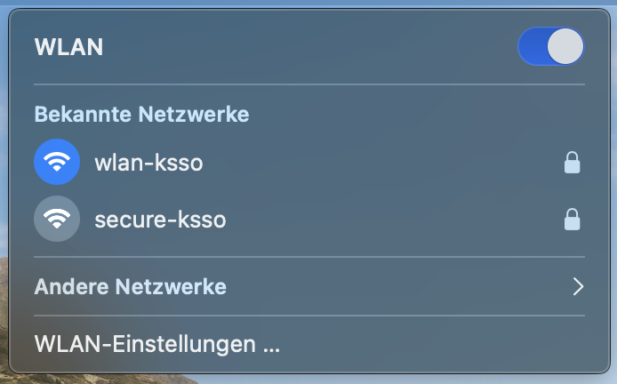
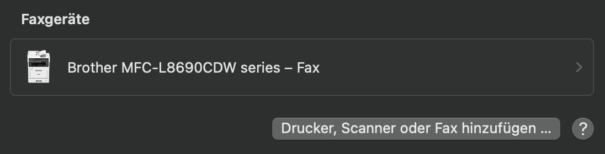
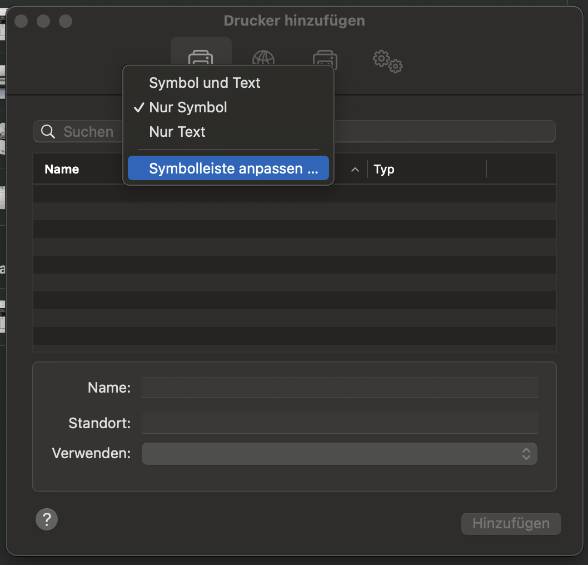
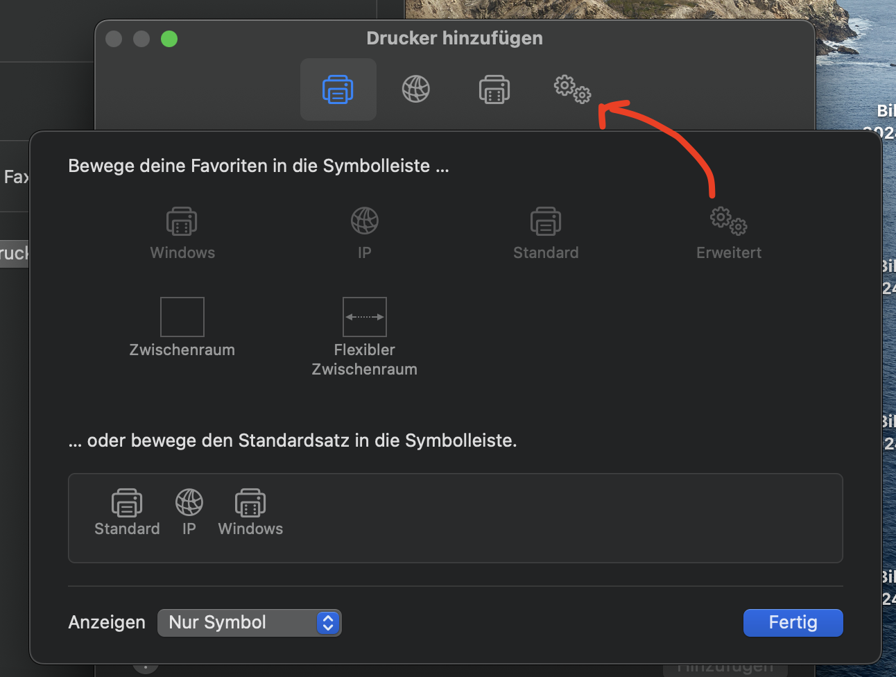
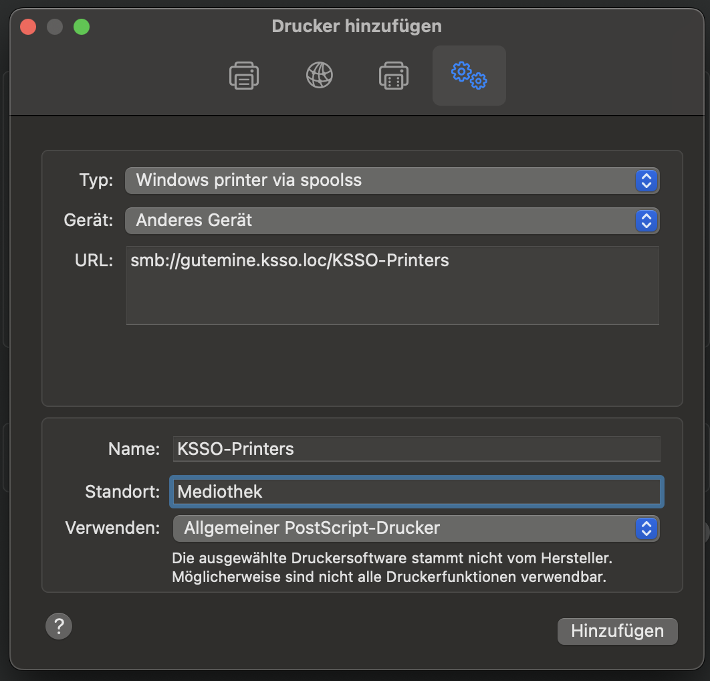

# Setting up the mediothek printer

*If you're reading this, you're dealing with a mac user. good luck lol*

1. Make sure they're connected to wlan-ksso

2. Open up System Settings
3. Select "Drucker & Scanner"

4. Select "Drucker, Scanner oder Fax hinzufügen"

5. *this is really fucking stupid* Right-Click on the TOP BAR WITH THE ICONS and select "Symbolleiste anpassen"

6. Drag "Erweitert" into the Top Bar

7. Click on the new icon
8. Fill out the fields accordingly

9. Add the printer
10. Make the user aware that upon an authentication request, they'll need to use their KSSO-Credentials

Man fuck this steaming shit OS.
